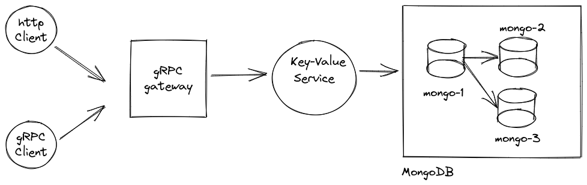
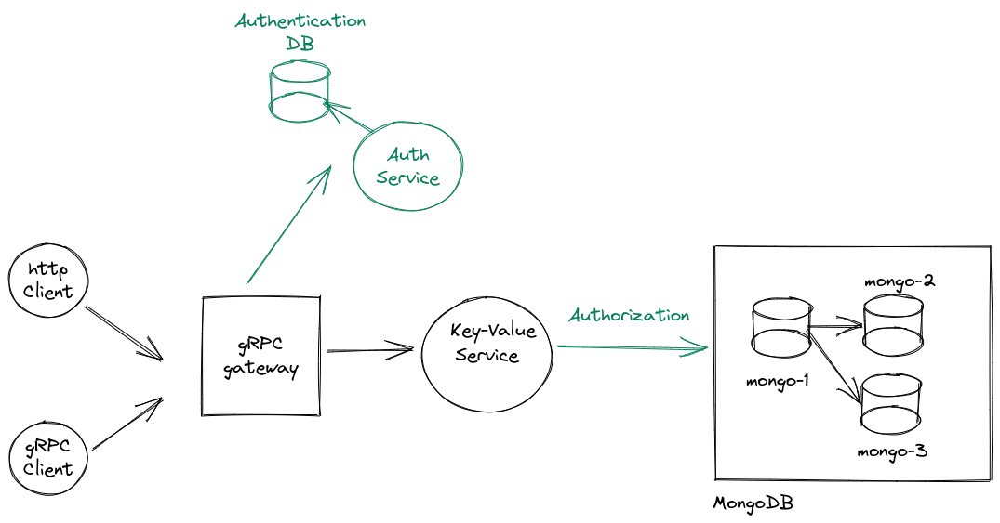

# Running

## Setup
- Run `go install` to install dependencies
- Run `make generate` to generate proto files.
- Run `./startdb.sh` to launch MongoDB with the replica set configuration.
 
## Run
- Run `go run ./main`

## Locations
- gRPC @ `localhost:8000`
- HTTP @ `localhost:9000/api`
- Swagger-docs @ `localhost:9000`

## Test
- Run `go test ./models` to run unit-tests
- Integration-tests:
    - Launch application with `go run ./main`
    - Install `newman` with `npm install newman` 
    - Add `newman` to `$PATH`: `export PATH=$(npm bin):$PATH`
    - Run `npm-exec newman run --insecure test.postman_collection.json` to run postman integration tests


# Architecture & Design choices



MongoDB is deployed as a replica set as transactional support is only given with at least this configuration: 
https://www.mongodb.com/community/forums/t/why-replica-set-is-mandatory-for-transactions-in-mongodb/9533/3


### Database
I chose MongoDB as a backend solution due to its NoSQL, sharding and replication capabilities. Furthermore, implementing
a multi-type column solution in an otherwise relational database is cumbersome and error-prone (Sparse table / EAV).
Additionally, it is possible to save events and key-values in the same table/collection, which allows for single document
operations and transactions improving efficiency. 

### Transport
I chose gRPC as transport as we gain a lot of cool properties OOB:
- Routing + validation + (un)marshalling
- More efficient than classical approaches (e.g HTTP/JSON)
- Interoperability with many languages (seamless micro-service integration)

# Questions & Design choices

## 1. How would you support multiple users?

In order to support multiple users, we need authentication. Furthermore, assuming we want to segregate users' key-values
according to their ID, we also need authorization. For our use-case in particular, using **stateless** authentication
seems best. It is both easier to implement, and we do not need session data. A common and ubiquitous pattern for this is
w.r.t JWT's.

If we only have one service, authorization & authentication could be done at service level, however this is not a very
sensible nor scalable solution as the security logic for authentication and authorization would be repeated in each 
service and would inevitably suffer from the shortcomings of monolithic architectures.

A better solution would be to decouple authentication from this process. We could offload the authentication part 
to an auth service and have it generate the JWT tokens. The latter would then be verified (asserting authentication)
on each service (or by the gateway - depending on the attack vectors considered) and the authorization would be done 
on a service basis. The schema would also have to be changed to accommodate for these changes, namely adding a `user_id`
to each key-value would suffice, or we could (more efficiently) create a collection per user.



## 2. How would you support answers with types other than string
To support multiple types other than string:
- Transport-wise: We could use gRPC's [Oneof](https://developers.google.com/protocol-buffers/docs/proto3#oneof) or 
[Any](https://developers.google.com/protocol-buffers/docs/proto3#any).
In either case, we would find at runtime the type of the `value` and we would attach the corresponding `type` to its 
entry. At unmarshalling time, we would use said `type` to obtain the correct data type.
- Client-side (only HTTP/JSON): depending on the approach attach metadata to each `value`:
  - ```
    // Any
    {  
    "value": {
      "@type": "google.protobuf.StringValue",
      "value": "1"
    }
    ```
  - ```
    // Oneof
    {
    "value_str": "1"
    }
    ```
    

## 3. What are the main bottlenecks of your solution?
Apart from the database, the rest of the components only do routing and (un)marshalling of data, effectively being 
I/O bound. Conversely, the database has to process the transactions themselves, becoming CPU bound.

## 4. How would you scale the service to cope with thousands of requests?
- Data Database: Besides vertically scaling the database, we could use sharding. In a sharding architecture we would have 
several mongo instances each of which with a subset of the total data. Given that we only have a collection and each 
document therein is identified by a single-key, we have the guarantee that transactions will execute with little to no
contention, deeming sharding a scalable solution.
- Authentication DB: If we further consider an authentication database, depending on the architecture that we choose, it
might become a bottleneck


# Links
- https://blog.tericcabrel.com/mongodb-replica-set-docker-compose/
- https://github.com/johanbrandhorst/grpc-gateway-boilerplate
